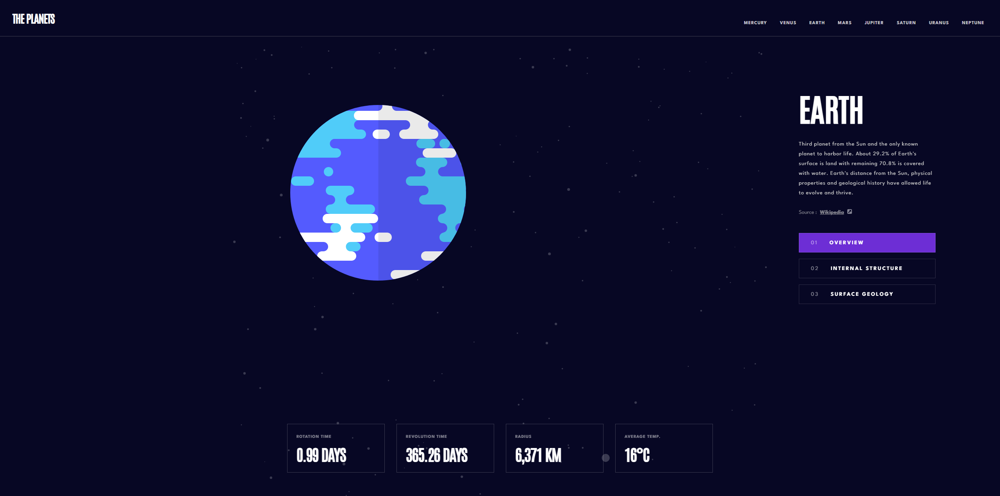

# 🌍 Planet Fact App

This is a web application that provides interesting facts about the planets in our solar system. The app is fully responsive, offering a smooth experience across all devices.

## Live Demo

You can explore the app live by visiting [Live Demo](https://planet-fact-gsay.vercel.app/).

## Features

- Discover fascinating facts about each planet in our solar system.
- Responsive design ensures optimal viewing on mobile, tablet, and desktop devices.
- Easy-to-navigate UI, making learning about planets enjoyable.

## How It Works

1. Select a planet to view detailed facts and information.
2. Explore the characteristics of different planets in a visually appealing way.
3. Enjoy the smooth and responsive interface on any device.

## Technologies Used

- HTML
- CSS
- JavaScript
- React

